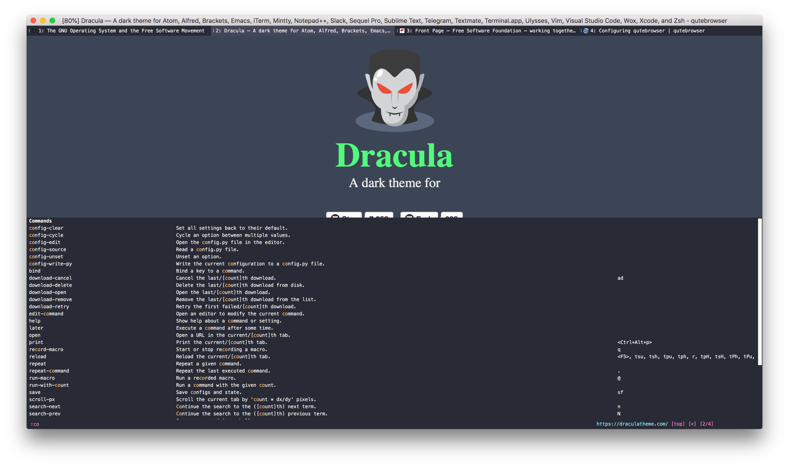

# Dracula for [qutebrowser](https://www.qutebrowser.org/)

> A dark theme for [qutebrowser](https://www.qutebrowser.org/).

## Install

All instructions can be found at [draculatheme.com/qutebrowser](https://draculatheme.com/qutebrowser).

## Team

This theme is maintained by the following person(s) and a bunch of [awesome contributors](https://github.com/dracula/template/graphs/contributors).

 |  | 
--- | --- | ---
[Evan Nagle](https://github.com/evannagle) | [Harrison Heck](https://github.com/nesl247) | [Zeno Rocha](https://github.com/zenorocha)

## License

[MIT License](./LICENSE)
